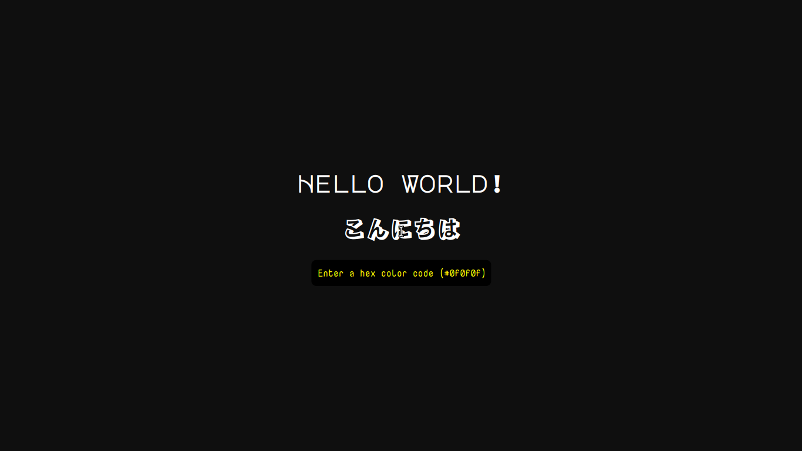

A minimalist hex color previewer intended to run in a browser.
Previews color in the background dynamically as you type hex values.

## View
[[Live Preview](https://hex-color-previewer.vercel.app/)] [[Source Code](https://github.com/saifshahriar/hex-color-previewer)]

## Tech Stack Used
[html, css, javascript]
